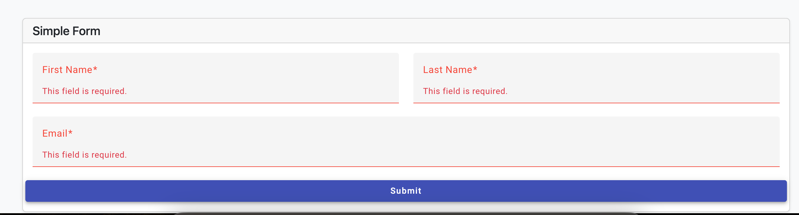
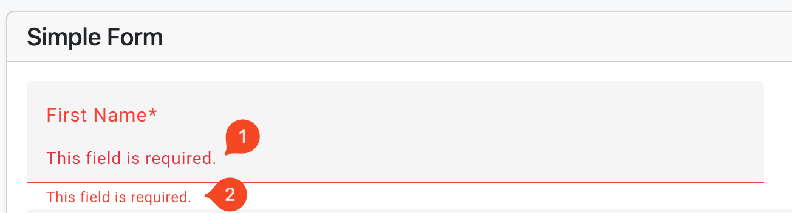
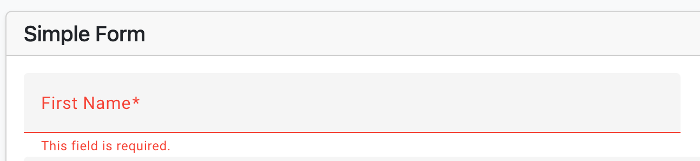
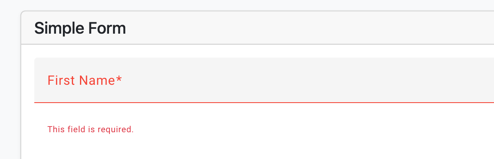
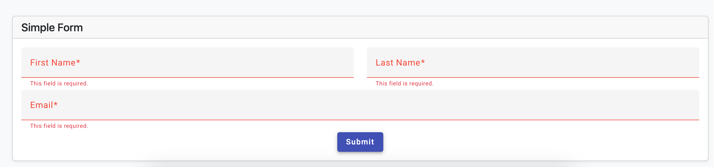

# How to use Angular Material with Validation On ABP

The ABP framework (Angular) has its own validation mechanism. default settings  may cause issues with Angular Material. In this example, I want to show how to use ABP client-side validation with Angular Material (ngx-validate).

### Creating project

I use that settings. 
`abp new BookStoreMaterial -t app-nolayers -u angular -dbms SQLite --theme basic -csf`

The Backend and Theme option is a little bit off-topic since I chose the simplest one.


### Add angular material in project.

To add Angular Material to your project, you can use the ng add command. Open your terminal and navigate to the root directory of your project. Then, run the following command:


```
ng add @angular/material
```

Using this command, you can set up your project to use Angular Material and install all of its dependencies:


### Form Validation
We have simple form with validation rules

```js
this.form = this.formBuilder.group({
  name: ['', Validators.required],
  email: ['', [Validators.required, Validators.email]],
  password: ['', [Validators.required, Validators.minLength(6)]],
});
```

The user sees errors when they clicked the submit button. It functions, but the expected visual behavior is out of place.
 
 


`mat-form-field` get access to error component and placed in the dom. See the Angular Material Form Error page to see how it works. 
 https://material.angular.io/components/form-field/overview#error-messages

```html
 <mat-form-field class="col">
      <mat-label>First Name</mat-label>
      <input matInput formControlName="firstName" />
       @if (firstName.invalid) {
      <mat-error>{{"AbpValidation::ThisFieldIsRequired" | abpLocalization}}</mat-error>
        }
    </mat-form-field>
```
 
It's better, yes, but there are two error messages.  NgxValidate created one, and the developer added two.

We can disable NgxValidation using an directive named `skipValidation`.



However, we must add each localization message individually. It is quite repetitive. 

Using the `validationTarget` and `ValidationContainer` attributes in NgxValidate, we can build error messages. The directive `validateContainer` is a pointer. For error messages, it defines or marks a parent. The location of the added error message is marked with `validationTarget`.

```html
    <mat-form-field class="col" validationContainer>
      <mat-label>First Name</mat-label>
      <input matInput formControlName="firstName" />
      <mat-error validationTarget />
    </mat-form-field>
```

yet my visual issue continues. due to the validation message being inserted by ngx-validate as a sibling. 



```css
mat-error {
  display: none !important;
}
.mat-mdc-form-field-error-wrapper .invalid-feedback{
  display:inline;
}
```

it works!


